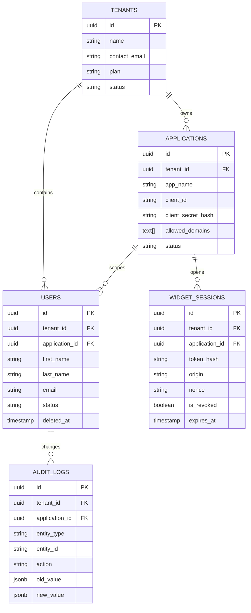
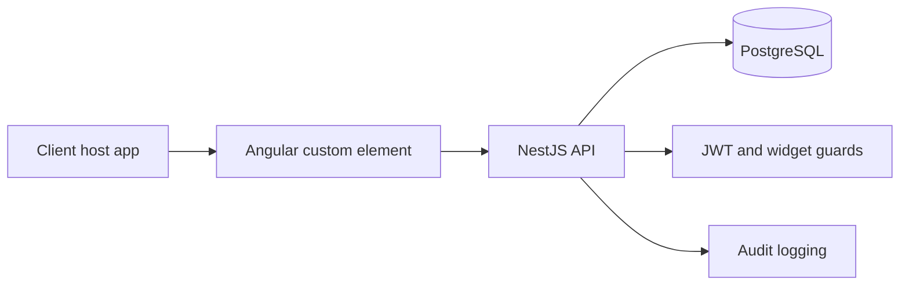
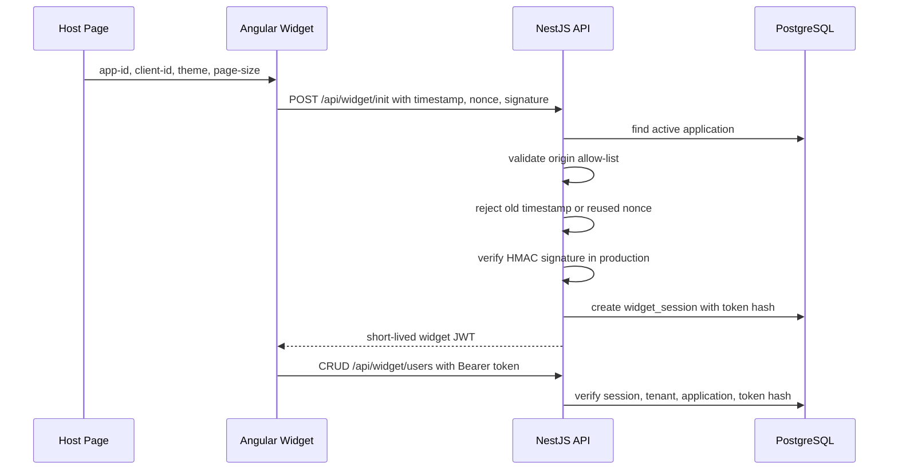

# User Management Widget

Secure embeddable user-management widget built with Angular custom elements, NestJS, PostgreSQL, and Docker.

## Run It

```bash
docker-compose up --build
```

Services:

- Angular widget: `http://localhost:4200`
- NestJS API: `http://localhost:3000/api`
- PostgreSQL: `localhost:5432`

Load demo data after the containers are running:

```bash
cd widget-server
npm.cmd run db:seed
```

Demo widget config:

```html
<script src="http://localhost:4200/main.js" async></script>
<user-management-widget app-id="6881a854-e0b4-4e9e-a11f-3257b1bf14ce" client-id="wgt_app_81e1549058187b6a"
theme="light" page-size="10">
</user-management-widget>
<script type="module" src="http://localhost:4200/main.js"></script>
```

In development the widget sends `dev-mode-bypass-signature`. In production, the embedding app backend must generate the HMAC signature. Do not put the client secret in browser code.

## Add A Website

A website is stored as an `applications` row. It belongs to a tenant and contains:

- `appName`: friendly name for the website.
- `clientId`: public ID used by the widget.
- `clientSecretHash`: encrypted secret used only by backend signing.
- `allowedDomains`: exact origins allowed to embed the widget.

Create a new website/application:

## http://localhost:3000/api/setup/register-app

```powershell
{
  "email": "angularapp@gmail.com",
  "companyName": "angular app",
  "appName": "Angular Dashboard",
  "allowedDomains": [
    "http://localhost:4201"
  ]
}
```

The script prints the new `app-id`, `client-id`, `client secret`, and embed snippet.

For local development, keep `http://localhost:4200` in `ALLOWED_ORIGINS`. For production, add only the real website origin, for example `https://portal.acme.com`.

## Database Setup

TypeORM runs migrations automatically when the API starts. The main config is:

- Runtime app config: `widget-server/src/app.module.ts`
- CLI migration config: `widget-server/src/database/typeorm.config.ts`
- Initial schema: `widget-server/src/database/migrations/1781433150268-InitialSchema.ts`
- Demo seed: `widget-server/src/database/seeds/seed.ts`
- Add website script: `widget-server/src/database/seeds/create-app.ts`

Core tables:

- `tenants`: customer/account boundary.
- `applications`: one embeddable app per tenant, with `client_id`, encrypted client secret, and allowed origins.
- `users`: managed users, scoped by `tenant_id` and `application_id`.
- `widget_sessions`: short-lived widget sessions, storing nonce and token hash for replay/revocation checks.
- `audit_logs`: user create/update/delete history.
- `auth_users`: admin/API users for back-office login.

## ER Diagram



Design choices:

- Every user query includes `tenantId` and `applicationId`, which prevents cross-tenant reads and writes.
- Users are soft-deleted with `deleted_at`.
- User email is unique per tenant and application, not globally.
- Widget session tokens are short lived and stored only as SHA-256 hashes.
- Allowed origins are stored on `applications`, so each client app controls where it may be embedded.

## System Architecture



The Angular widget is packaged as a custom element with Shadow DOM isolation. The NestJS API validates widget sessions, applies tenant/application scoping, and writes audit records for mutations.

## Widget Auth Flow



Production signature:

```text
message = appId + ":" + clientId + ":" + timestamp + ":" + nonce
signature = hmac_sha256(clientSecret, message)
```

## Security Design

- Unauthorized embedding: `Origin` must exactly match an application allowed origin. Prefix matching is intentionally avoided.
- Replay protection: widget init requires a fresh timestamp and unique nonce.
- Rate limiting: global Nest throttling is enabled in `AppModule`.
- Input validation: DTOs use `class-validator`; unknown properties are rejected by the global validation pipe.
- Token handling: widget JWTs are short lived, sent as Bearer tokens, and verified against the stored session token hash.
- Revocation: `POST /api/widget/revoke` marks the session revoked.
- Tenant isolation: all widget user APIs derive `tenantId` and `applicationId` from the verified widget token, never from client input.
- Secret handling: client secrets are encrypted at rest and must not be exposed in frontend code.

## API Documentation

Widget session:

- `POST /api/widget/init`
  Body: `{ appId, clientId, signature, timestamp, nonce }`
  Returns: `{ token }`

- `POST /api/widget/revoke`
  Header: `Authorization: Bearer <widget-token>`
  Returns: `{ success: true }`

Widget users:

- `GET /api/widget/users?page=1&limit=10&search=&sortBy=createdAt&sortOrder=DESC`
- `POST /api/widget/users`
- `GET /api/widget/users/:id`
- `PATCH /api/widget/users/:id`
- `DELETE /api/widget/users/:id`
- `DELETE /api/widget/users/bulk`
- `PATCH /api/widget/users/bulk-status`

User body:

```json
{
  "firstName": "Ada",
  "lastName": "Lovelace",
  "email": "ada@example.com",
  "status": "ACTIVE"
}
```

## Tests

```bash
cd widget-server
npm.cmd test
npm.cmd test:e2e

cd ../widget-ui
npm.cmd test
```

Recommended coverage areas:

- User CRUD, search, sort, pagination, soft delete.
- Tenant/application isolation.
- Valid widget init, expired timestamp, reused nonce, invalid origin.
- Revoked and expired widget tokens.
- Angular loading, empty, error, create, edit, delete, and validation states.
